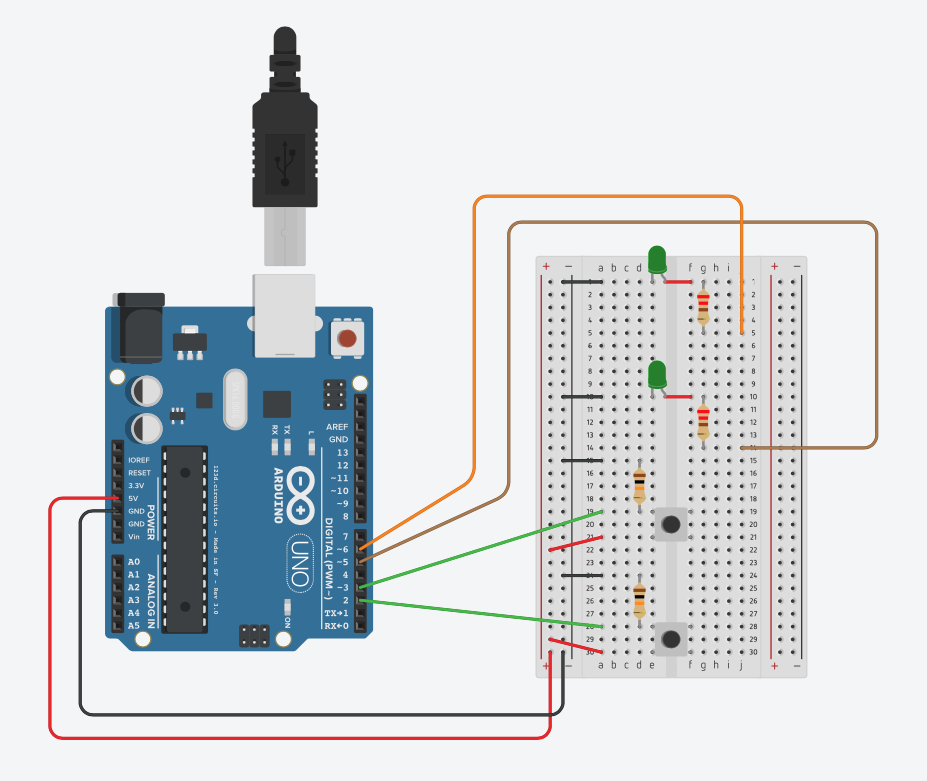

# Introduksjon {.intro}

La oss se på å få ett display til å telle.

# Steg 1: Finn frem utstyr {.activity}

## Til denne oppgaven trenger du {.check}

+ 1 Arduino Uno
+ 1 breadboard
+ 2 motstander 10k Ohm (Fargekode: brun-svart-gul-gull)
+ 2 motstander 220 Ohm (Fargekode: rød-rød-brun-gull)
+ 2 knappbrytere
+ 2 lysdioder (du velger farge)
+ x antall ledninger

# Steg 2: Utforskning {.activity}
