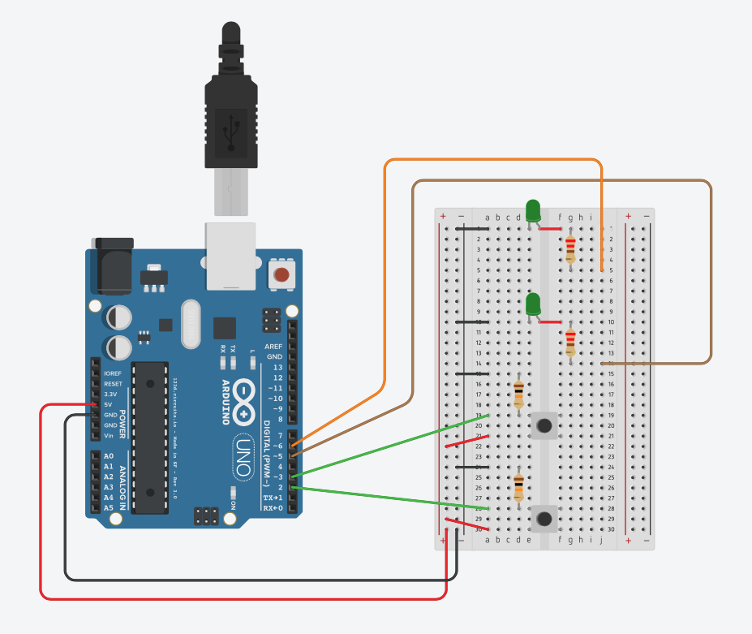

# Introduksjon {.intro}

La oss dimme lysdioder med hjelp av PWM. PWM står for Pulse-Width-Modulation,
på norsk betyr dette Puls-Bredde-Modulering. Dette er en styring som brukes der en vil ha riktig spenning, men regulere effekten. Som feks til å dimme en lysdiode som ikke skal ha lavere eller høyere spenning enn 1,8-2,2volt.

Arduino leverer firkantpuls på 5volt. Denne firkantpulsen har fast fast periodetid (frekvens), men vi kan justere pulsbredden.

### Illustrasjon av PWM (PBM) {.protip}


# Steg 1: Finn frem utstyr {.activity}

## Til denne oppgaven trenger du {.check}

+ 1 Arduino Uno
+ 1 breadboard
+ 2 motstander 10k Ohm (Fargekode: brun-svart-gul-gull)
+ 2 motstander 220 Ohm (Fargekode: rød-rød-brun-gull)
+ 2 knappbrytere
+ 2 lysdioder (du velger farge)
+ 12 ledninger




# Steg 2: Utforskning {.activity}

Alle pinner som har ~ symbolet, har PWM egenskapen.

+ Sjekk at alt er riktig koplet opp.
+ PIN 5 & PIN 6 er brukt til lys.


### Tips! {.protip}
```cpp
Bruk gjerne kommentarer til deg selv når du programmerer. Da er det lettere å
forstå koden mens du holder på.

// Dette er en linje kommentar til koden.

/*Dette er flere linjer
med kommentarer*/
```
# Steg 3: Dimme ett lys med knappbrytere {.activity}

## Skriv kode {.activity}

```cpp
int led1 = 5;
int led2 = 6;

int knapp1 = 2;
int knapp2 = 3;

int PWM_1 = 0;
int PWM_2 = 255;


void setup() {

  pinMode(led1, OUTPUT);
  pinMode(led2, OUTPUT);
  pinMode(knapp1, INPUT);
  pinMode(knapp2, INPUT);
  Serial.begin(9600);
}


void loop() {

  while (digitalRead(knapp2) == HIGH)
  {
    PWM_1 = PWM_1 + 5;
    if (PWM_1 >= 255) { //Sjekker at PWM_1 ikke går høyere enn 255.
      PWM_1 = 255;
    }
    analogWrite(led1, PWM_1);
    delay(100);
    Serial.println(PWM_1);
  }

  while (digitalRead(knapp1) == HIGH)
  {
    PWM_1 = PWM_1 - 5;
    if (PWM_1 <= 0) { //Sjekker at PWM_1 ikke går lavere enn 0.
      PWM_1 = 0;
    }
    analogWrite(led1, PWM_1);
    delay(100);
    Serial.println(PWM_1);
  }

}

```


# Steg 4: Test ut dimmefunksjonen {.activity}

## Sjekkliste {.check}

+ Øker styrker i lyset.
+ Synker styrken i lyset.
+ Får du opp PWM verdien i Serial Monitor.

### Utfordringer {.challenge}
+ Klarer du å endre teller intervallet, slik at styrken øker raskere eller tregere.


# Steg 5: Dimme begge lys med knappbrytere {.activity}

## Skriv kode {.activity}
```cpp
...

void loop() {
  analogWrite(led1, PWM_1);
  analogWrite(led2, PWM_2);

  //KNAPP NEDE
  while (digitalRead(knapp1) == HIGH)
  {
    if (PWM_1 >= 255) {
      while (digitalRead(knapp1) == HIGH) {
        digitalWrite(led2, LOW);
        digitalWrite(led1, HIGH);
        delay(100);
        digitalWrite(led1, LOW);
        delay(100);
      }
    }
    PWM_1 = PWM_1 + 5;
    PWM_2 = PWM_2 - 5;
    if (PWM_1 >= 255)PWM_1 = 255;
    if (PWM_2 <= 0) PWM_2 = 0;
    delay(100);
    analogWrite(led1, PWM_1);
    analogWrite(led2, PWM_2);
    Serial.println(PWM_1);
    Serial.println(PWM_2);

  }

  //KNAPP OPPE
  while (digitalRead(knapp2) == HIGH)
  {
    if (PWM_2 >= 255) {
      while (digitalRead(knapp2) == HIGH) {
        digitalWrite(led1, LOW);
        digitalWrite(led2, HIGH);
        delay(100);
        digitalWrite(led2, LOW);
        delay(100);
      }
    }
    PWM_2 = PWM_2 + 5;
    PWM_1 = PWM_1 - 5;
    if (PWM_2 >= 255)PWM_2 = 255;
    if (PWM_1 <= 0) PWM_1 = 0;
    delay(100);
    analogWrite(led2, PWM_2);
    analogWrite(led1, PWM_1);
    Serial.println(PWM_1);
    Serial.println(PWM_2);
  }
}

```

## Sjekkliste {.check}

+ Øker styrker i det ene lyset samtidig som det andre synker.
+ Får du opp PWM verdien i Serial Monitor.

### Utfordringer {.challenge}
+ Klarer du å endre teller intervallet, slik at styrken øker raskere eller tregere.
+ Klarer du å gjøre dimmefunksjonen automatisk.
